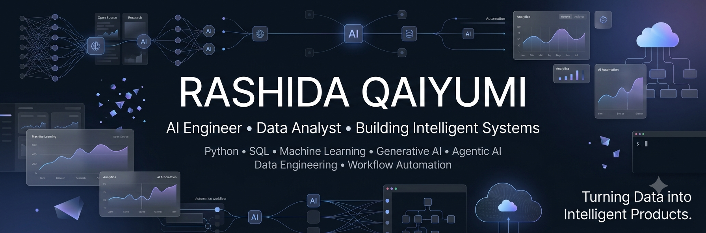

  

# 👋 Hi, I'm Rashida Qaiyumi

### Building Intelligent AI Systems

 

---

# 🚀 About Me

I'm an **AI & Data Science Graduate** passionate about building intelligent applications that combine **Artificial Intelligence, Machine Learning, Automation, and Software Engineering**.

Instead of building isolated models, I enjoy creating complete AI-powered products that solve real-world problems.

### My Interests

- 🤖 Artificial Intelligence
- 🧠 Machine Learning
- 💬 Large Language Models (LLMs)
- ⚡ AI Agents
- 🔄 Workflow Automation
- 🌐 Full Stack AI Applications
- 📊 Data Intelligence
- 🌍 Open Source

---

# 🎯 Currently Exploring

- 🤖 AI Agents
- 🧠 Generative AI
- 💬 Retrieval-Augmented Generation (RAG)
- ⚡ AI Automation
- 🚀 Full Stack AI
- 🌍 Open Source

---

# 🛠 Tech Stack

### Languages

### AI / Machine Learning

### Frameworks

### Databases

### Tools

Git • GitHub • Docker • VS Code • Jupyter • Power BI • Excel • n8n

---

# 🚀 Featured Projects

| Project | Description |
|----------|-------------|
| 🌊 Underwater Image Enhancement | Deep learning-based underwater image restoration |
| ⚖️ Musab Learning Platform | Full-stack learning management platform |
| 🎨 AI Color Detection | Real-time computer vision application |
| 🤝 AllySphere | AI-powered collaboration platform |
| 📊 Python & SQL Projects | Analytics and automation projects |

---

# 📈 GitHub Analytics

---

# 🌱 2026 Goals

- 🚀 Build impactful AI applications
- 🤖 Develop AI Agents
- 🧠 Master LLM Engineering
- ⚡ Build AI Automation Workflows
- 🌍 Contribute to Open Source
- 💼 Begin my career as an AI Engineer

---

# 💡 Philosophy

> **"Great AI isn't just about building models. It's about building products that make people's lives better."**

---

## 🤝 Let's Connect

